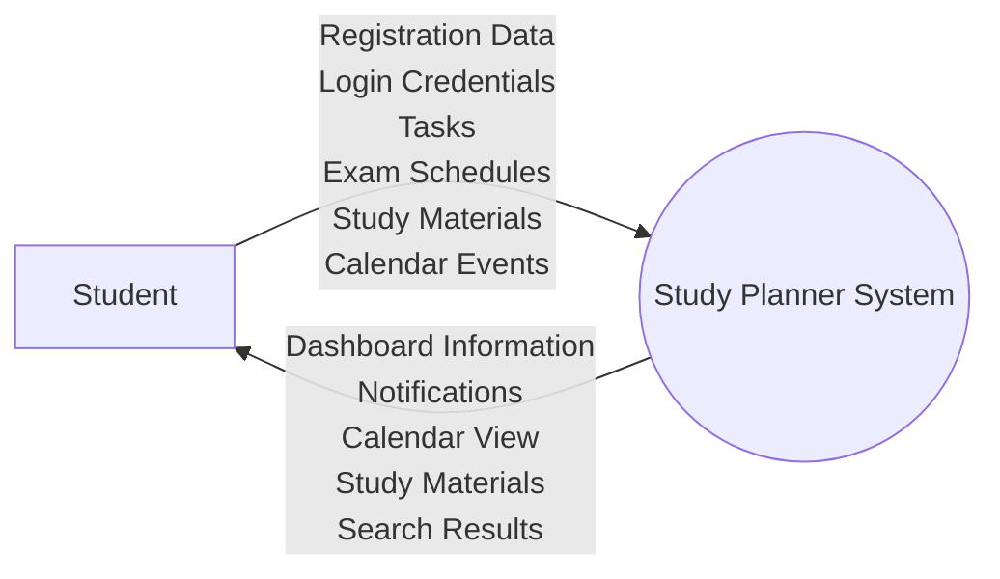
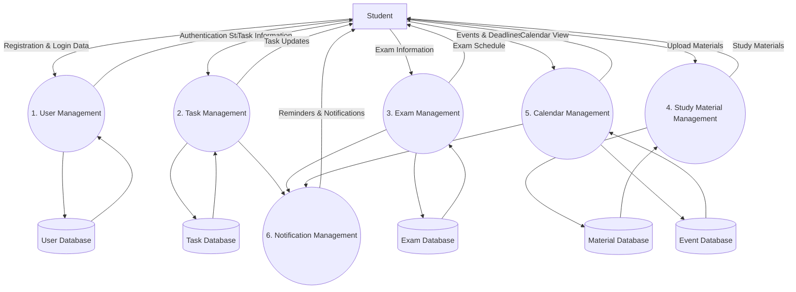

# Work in Progress #
# Data Flow Diagram (DFD)

## Introduction

This document illustrates how data flows through the Centralized Study Planner and Management System. The diagrams identify the external entities, processes, data stores, and the movement of information within the system.

---

# Level 0 DFD (Context Diagram)

The Level 0 DFD represents the entire Study Planner System as a single process interacting with the student.



---

# Level 1 DFD

The Level 1 DFD decomposes the main system into its major functional processes.



---

# DFD Components

## External Entity

### Student

The primary user of the system who manages academic tasks, examinations, study materials, and calendar events.

---

## Processes

### 1. User Management

Handles registration, authentication, profile management, and account access.

### 2. Task Management

Handles task creation, modification, deletion, categorization, and completion tracking.

### 3. Exam Management

Handles examination schedules and exam-related information.

### 4. Study Material Management

Handles uploading, storing, organizing, retrieving, and deleting study resources.

### 5. Calendar Management

Handles academic events, deadlines, and calendar visualization.

### 6. Notification Management

Generates reminders and notifications for upcoming tasks, examinations, and events.

---

## Data Stores

### User Database

Stores user account and profile information.

### Task Database

Stores task details, deadlines, priorities, and completion status.

### Exam Database

Stores examination schedules and related information.

### Material Database

Stores uploaded study materials and associated metadata.

### Event Database

Stores academic events, deadlines, and calendar entries.

```
```
